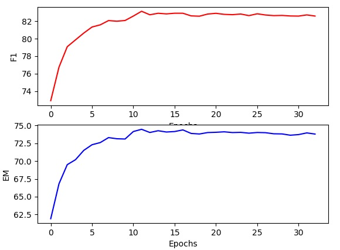

# FusionNet: Fusing via Fully-aware Attention with Application to Machine Comprehension
* 위 코드는 해당 논문( https://openreview.net/forum?id=BJIgi_eCZ )을 구현한 코드 입니다.

# Requirements
* python 3.5
* pytorch 0.3.1
* numpy
* usjon
* msgpack
* spacy

# data preprocess
SQuAD data의 preprocess는 https://github.com/HKUST-KnowComp/R-Net 의 prepro.py를 약간 수정해서 사용하였습니다.

# 논문의 내용과 다른점
* 논문에서는 original match, lower match, lemma match, normalized term-frequency 4개의 features를 사용 하였지만 코드에는 original match만 사용 하였습니다.
* 논문에서는 question에서 자주 나오는 단어 top 1000개의 단어 임베딩만 학습을 시키고 나머지는 fix 하였지만, 위 코드에서는 모든 단어 임베딩을 fix 하였습니다.

# Quick start
* python SQuAD_prepro.py 를 이용해 data를 preprocess 한 후에 python train.py

# 성능표
* F1 = 81.56%
* EM = 72.56%

* 모델 학습은 네이버 클라우드 플랫폼 GPU Tesla P40 에서 batch size 256으로 학습을 진행 하였습니다. batch size가 커서 GPU 메모리 문제가 발생 할 수 있으니 batch size를 16 or 32 로 설정하시고 돌리시면 GPU 메모리 문제는 해결될 겁니다.

